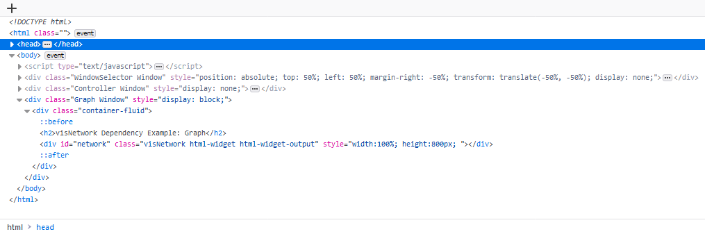
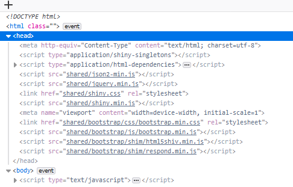
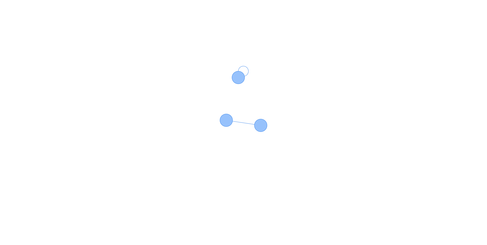
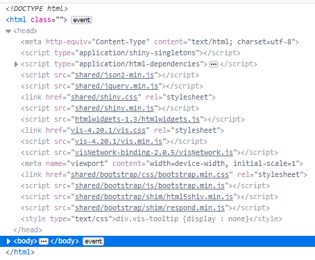
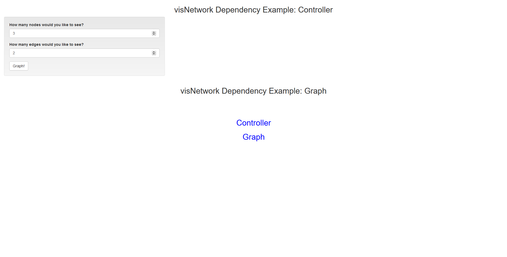
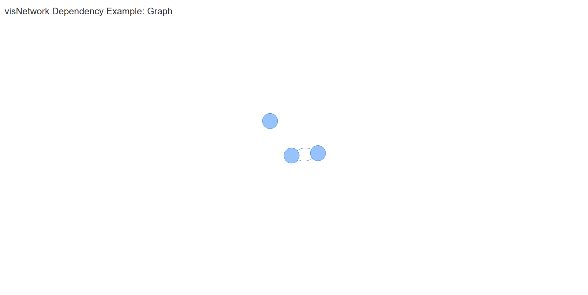

<style type="text/css">

h1.title {
  text-align: center;
}
h4.author { 
  text-align: center;
}
h4.date { 
  text-align: center;
}
</style>


```{r setup, include = FALSE}
knitr::opts_chunk$set(
  # collapse = FALSE,
  # comment = "#>"
  results = "hold"
)
```

The *mwshiny* package provides a simple function, mwsApp(), which allows you to create Shiny apps that span multiple windows. While it works with any package, some packages have dependencies on various .js and .css files, which are not automatically imported when creating a Multi-Window Shiny app. Thus, mwsApp() allows you to specify specific dependencies in various packages that your app uses. This vignette shows you how to do this, finding the files your packages need and specifying them directly. I'll assume basic knowledge of Shiny and mwshiny throughout this vignette.

I'll start with setting up a basic multi-window app using the visNetwork package, which has various .js and .css dependencies.

## Load Libraries and Specify Our Inital App

As with any mwshiny application, we start by loading our libraries that we want globally accessed.

```{r load libraries, results = 'hide', warning=F}

# our multi-window shiny friend
library(mwshiny)
# visNetwork is a package for visualization of graphs and networks, and is dependent on .js and .css scripts for visualizations in Shiny apps
library(visNetwork)

```

Next, I'll just naively specify a simple mwshiny app without any dependencies. My app is going to have two windows: "controller" and "visualization" windows. The controller specifies the number of nodes and edges in my graph, and the visualization window just shows our graph.

```{r specify app}

# the titles of our windows
win_titles <- c("Controller", "Graph")

ui_win <- list()

# first we add what we want to see in the controller to the list
ui_win[[1]] <- fluidPage(
  titlePanel("visNetwork Dependency Example: Controller"),
  sidebarLayout(
    # where all our choices will go
    sidebarPanel(
      # choose the number of nodes, from 3 to 10
      numericInput(inputId = "num_nodes",
                   label = "How many nodes would you like to see?",
                   value = 3,
                   min = 3,
                   max = 10),
      # choose the number of edges, from 2 to 9
      numericInput(inputId = "num_edges",
                   label = "How many edges would you like to see?",
                   value = 2,
                   min = 2,
                   max = 9),
      # only build our graph when this button is clicked
      actionButton(inputId = "go",
                   label = "Graph!")
      
    ),
    # empty main panel
    mainPanel()
  )
)

# next we add what we want to see in the visualization window to the ui list
ui_win[[2]] <- fluidPage(
  titlePanel("visNetwork Dependency Example: Graph"),
  visNetworkOutput(outputId="network", 
                   height = "800px")
)

# now we do some calculations based on our inputs, to pass to our final rendering of our network
serv_calc <- list()

serv_calc[[1]] <- function(calc, sess){
  observeEvent(calc$go, {
    # create our nodes data frame for the visNetowrk render plot to use
    calc[["nodes"]] <- data.frame(id = 1:calc$num_nodes)
    
    # create our edges data frame, specifying a random set of nodes to connect
    calc[["edges"]] <- data.frame(from = sample(calc$num_edges, calc$num_edges, replace = T),
                                  to = sample(calc$num_edges, calc$num_edges, replace = T))
  })
}

# now we render our output!
serv_out <- list()

serv_out[["network"]] <- function(calc, sess){
  # this function renders our graph, for shiny purposes
  renderVisNetwork({
    # don't render anything if we haven't pressed the graph! button yet!
    if (!is.null(calc$nodes) & !is.null(calc$edges)){
      visNetwork(calc$nodes, calc$edges)
    }
  })
}

```

Now that we have our app, let's run it!

```{r mwsapp naive, eval=F}
#run!
mwsApp(win_titles, ui_win, serv_calc, serv_out)
```

When we do run it, we initially see what we would expect -- our controller and our visualization window, with no graph, since we haven't pressed anything yet.

```{r, out.width="325px", fig.show="hold",echo=F}
knitr::include_graphics(c("figures/init_naive_controller.png", "figures/init_naive_vis.png"))
```

However, when we do press our button, we see... nothing. No plot in the visualization window. What's going on?

## Figuring Out Dependencies by Making a Minimal Shiny Application

So, there's clearly something going wrong here, since our code is correct. As it turns out, the problem is that we haven't specified the dependencies necessary to actually run our application. Let's figure out what's missing by using the developer console in our broswer (Ctrl/Cmd+Shift+C in Firefox or Chrome). Opening this on the visualization window, we see the HTML that is dictating our page:

```{r, out.width="600px", fig.align='center', echo=F}

```

If we click to open the "head" tag, we see a lot of .js and .css scripts that our page is using:

```{r, out.width="400px", fig.align='center', echo=F}

```

Keep those in mind. So, since our mwshiny app isn't working, we go to the next logical step: making a minimal Shiny application that represents our visualization and checking on that rendered HTML. Since our visualization is the thing that isn't working, we'll just focus on making a visNetwork graph, with no interactions:

```{r shiny, eval=F}

# shiny is already loaded by mwshiny

# our UI, which is going to just show a default graph
ui <- fluidPage(
  visNetworkOutput(outputId="network", 
                   height = "800px")
)

# our server function, which renders our graph
server <- function(input, output, session) {
  
  # the necessary components of a graph with 3 nodes and 2 edges
  nodes <- data.frame(id = 1:3)
  edges <- data.frame(from = c(1,2), to = c(1,3))
  
  # render our network for the UI
  output$network <- renderVisNetwork({
      visNetwork(nodes, edges)
  })
}

# run this app!
shinyApp(ui, server)
```

When we run our Shiny app, we see:

```{r, out.width="400px", fig.align='center', echo=F}

```

Exactly what we would expect! A graph with 3 nodes and 2 edges. So, what is the difference between our Shiny app and our mwshiny app? Let's check out the developer console on this page. When we open the head tag here, we can see that there are a few more scripts and stylesheets listed than in our mwshiny app:

```{r, out.width="400px", fig.align='center', echo=F}

```

Comparing this list to the one given by mwshiny, it looks like there are 4 scripts not reflected in the mwshiny app: htmlwidgets.js, vis.css, vis.min.js, and visNetwork.js. How do we import these to our mwshiny app? First, we need to figure out which packages correspond to these scripts. Luckily, there's a simple base function that lists the scripts in each package. 

Let's start by trying to find htmlwidgets.js. Looking at the file extension, we see that this might come from the htmlwidgets package, so we can check this with a simple command:

```{r htmlwidgets find}
# this command prints all files in the htmlwidgets package that end with .js
print(list.files(path=system.file(package = "htmlwidgets", mustWork = T),pattern = "\\.js$", recursive = T))
```

There it is! So we know that we'll have to state htmlwidgets as a dependency for mwshiny. Following a similar thought process, let's look at the .js and .css files in the visNetwork package (there is no vis package, but it's easy to guess where it comes from).

```{r}
# this command prints all files in the visNetwork package that end with .js
print(list.files(path=system.file(package = "visNetwork", mustWork = T),pattern = "\\.js$", recursive = T))

# for ease of viewing, print some blank lines to separate the javascript
cat("\n\n")

# this command prints all files in the visNetwork package that end with .css
print(list.files(path=system.file(package = "visNetwork", mustWork = T),pattern = "\\.css$", recursive = T))
```

Looking through, we can see our final missing .js and .css files, so there we have our final dependency! Let's now bring them in and run our mwshiny app accordingly.

## Adding Dependencies with All Scripts to mwsApp()

So now we have htmlwidgets and visNetwork as packages we want to state as dependencies. mwsApp() has the option, depend, a named list with the names corresponding to the packages for which .js and .css files will be imported. If value for that package is NA, all .js and .css files will be imported. Otherwise, value must be a vector of strings corresponding to the .js and .css files to be imported, with location relative to the package folder.

We're going to start by importing all of the .js and .css scripts in our dependencies:

```{r mwsapp all, eval=F}
# we're going to load htmlwidgets explicitly for clarity
library(htmlwidgets)

# alloctate our named dependency list
depend <- list()
# names of the list correspond to the package we want to import
# we give each of them the value NA, because we're going to import all .js and .css files from our packages
depend[["htmlwidgets"]] <- NA
depend[["visNetwork"]] <- NA

#run with dependencies!
mwsApp(win_titles, ui_win, serv_calc, serv_out, depend)
```

Great! We've added our imported all the files, so everything should work out now, right? Well, not quite. Looking at our page, we see quite a mess:

```{r, out.width="400px", fig.align='center', echo=F}

```

All the pages have collapsed into one page! It seems that by importing all of the .js and .css files from our packages, we've created some sort of conflict. We can see above that there are a lot of opportunities with the visNetwork package, since it has a lot of scripts.

However, we know from our examination of the console that we don't need all of those scripts -- just 4. So we can specify those directly. (Note: it does work for some packages to use the simple way out and import all packages, but others, such as visNetwork, need more specificity.)

## Adding Dependencies with Specific Scripts to mwsApp()

In order to add only specific dependencies, we need to find out their paths relative to the package folder. Since we've printed all the locations of our folders above, they should be easy enough to find and copy-paste appropriately. We're going to put the extensions of our .js and .css files for each package in a vector of strings as the value for our depend list.

Note that order matters -- these scripts will be loaded in the order that they're specified. So, in the following, "htmlwidgets.js"is added first, then "vis.css", and so on. If scripts later in the order depend on previous scripts, it's important to specify the dependencies first.

```{r mwsapp specific, eval=F}
# names of the list correspond to the package we want to import
# we give each of them the value of a vector of strings corresponding to the specific scripts we want to import
depend[["htmlwidgets"]] <- c("www/htmlwidgets.js")
depend[["visNetwork"]] <- c("htmlwidgets/lib/vis/vis.css", "htmlwidgets/lib/vis/vis.min.js", "htmlwidgets/visNetwork.js")

#run with dependencies!
mwsApp(win_titles, ui_win, serv_calc, serv_out, depend)
```

Now that we've limited our imported dependencies to just the missing scripts, we can see that our mwshiny app works perfectly:

```{r, out.width="400px", fig.align='center', echo=F}

```

Thus, For JS and CSS-dependent packages, we can bring in the necessary JS and CSS scripts we need to create good visualizations and interfaces. 
