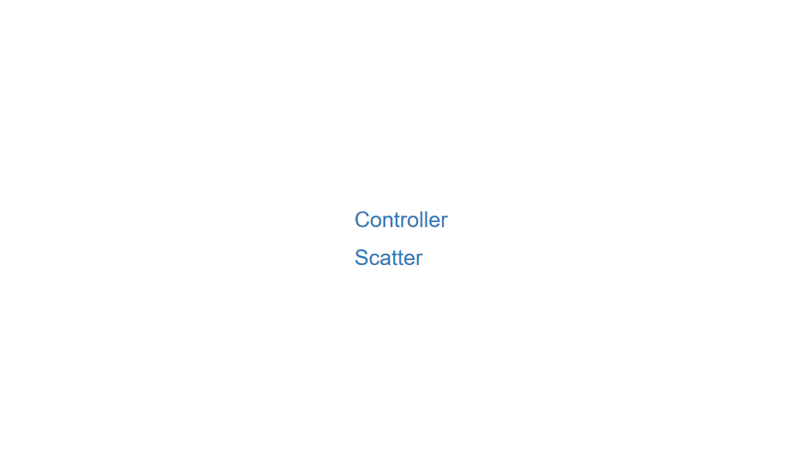

<style type="text/css">

h1.title {
  text-align: center;
}
h4.author { 
  text-align: center;
}
h4.date { 
  text-align: center;
}
</style>


```{r setup, include = FALSE}
knitr::opts_chunk$set(
  # collapse = FALSE,
  # comment = "#>"
  results = "hold"
)
```

*mwshiny* provides a simple function, mwsApp(), which allows you to create Shiny apps that span multiple windows. It uses all the same conventions and applications as a normal Shiny function. To learn more about Shiny and find some tutorials, please visit their [website](https://shiny.rstudio.com/). I'll assume basic knowledge of Shiny throughout this vignette.

For now, I'm going to set up a basic multi-window app using the iris dataset, a dataset of several plant species. Note that mwshiny works best when apps are run in external browser windows.

## Load Libraries and Datasets

As in any typical Shiny app, you start by loading any necessary libraries and data that you want to be globally accessed. I'll start by doing that with visualization libraries and the iris dataset.

```{r load, echo=T, results = F, warning=F}
# load libraries
# note that attaching mwshiny also attaches Shiny
library(mwshiny) # our multiwindow app
library(ggplot2) # cool visualizations
library(datasets) # contains the iris dataset
```

Let's load our iris data and get an idea of what it looks like.

```{r iris data}
data(iris) # load iris data
summary(iris) # just to get a look at what we're dealing with here

```

## Set Up UI for Each Window

Now that I've loaded my data and packages, I need to set up what my windows are going to look like. For this mwshiny app, I'm going to have one window be my "controller", where I change all my inputs, and the other one be a window where my output is going to be. My output is going to be scatter plots of the data, colored by species.

```{r ui}
# vector of strings that are the names of my windows
win_titles <- c("Controller","Scatter")

ui_win <- list()

# first we add what we want to see in the controller to the list
ui_win[[1]] <- fluidPage(
  titlePanel("Iris Dataset Explorer: Controller"),
  sidebarLayout(
    sidebarPanel(
      # choose what goes on the x axis
      selectInput(inputId = "x_axis",
                  label = "What would you like to see on the x axis?",
                  choices = colnames(iris)[colnames(iris)!="Species"]),
      # choose what goes on the y axis
      selectInput(inputId = "y_axis",
                  label = "What would you like to see on the y axis?",
                  choices = colnames(iris)[colnames(iris)!="Species"]),
      # choose which groups you want to see
      checkboxGroupInput(inputId = "spec",
                         label = "Which species would you like to see?",
                         choices = as.character(unique(iris$Species)),
                         selected = as.character(unique(iris$Species))),
      # only build the scatter plot when this is clicked
      actionButton(inputId = "go",
                   label = "Build!")
    ),
    # just an empty main panel
    mainPanel()
  )
)

# then we add what we want to see in the scatter section
ui_win[[2]] <- fluidPage(
  titlePanel("Iris Dataset Explorer: Scatter"),
  plotOutput(outputId = "iris_scatter")
)

```

Note that win_titles and ui_win are the same length. Also, the UI that I want to see in each window matches up to their title (i.e., the UI I want for the controller window is first, then the scatter UI is second in the list). Further, window titles cannot contain spaces or have any duplicates.

## Set Up the Calculations

Now that my UI is all set up, I want to set up a derived dataframe that I'll use in my output, created when I click my "Build!" button. Note that this isn't explicitly necessary to do if you would prefer to do such things in render functions -- but if you're using any observe()-type capabilities, this is the variable to do it in.

serv_calc is a list of functions of the form function(calc, sess), where any calculations based on input are done. calc is a reactive list containing all the input values with the same names and can be accessed in the same way (calc$x or calc[[x]]). Any variables that you've made that you want to pass to input should be added to calc with a name, which is a named list of reactive variables. This is done in the traditional manner, i.e. calc[["y"]] <- y. sess is the traditional Shiny session variable. Note that these functions follow the traditional Shiny restrictions (reactive variables can only be used in a reactive context, etc.)!

Further, if you want render objects later based on an observe()-type change, assign the result that you will be using in the render to calc. We can see an example of that interaction below, where we use calc[["sub.df"]] in our render, which changes as the result of our observeEvent().

It's recommended for clarity that you make one function entry for each observe()-type function you're using, but it's not explicitly necessary.

```{r serv_calc}
# setting up the list of calculations I want to do
serv_calc <- list()

# I only want to build a scatterplot when I click my build button, so my list will be of length 1
serv_calc[[1]] <- function(calc, sess){
  # this is going to activate any time I press "build!"
  observeEvent(calc$go, {
    # create our data frame for visualizing
    sub.df <- data.frame("x" = iris[iris$Species %in% calc$spec,calc$x_axis],
                         "y" = iris[iris$Species %in% calc$spec,calc$y_axis],
                         "species"=iris[iris$Species %in% calc$spec,"Species"])
    
    # add this to calc, since we want to use this in our rendering
    calc[["sub.df"]] <- sub.df
  })
}

```

## Set Up the Output

Now that I've calculated based on input and set that up to work only when I click "build!", I want to actually render my plot for output.

serv_out is a named list of functions, where each function in the list corresponds to the output that it renders. Functions are of the form function(calc, sess), where calc is the named list which contains traditional Shiny input and the calculated variables that we added to previously, and sess is the traditional Shiny session variable. Entries in both lists can be accessed in a normal manner (i.e. calc$x or calc[["y"]]). These functions also follow the standard Shiny restrictions.

```{r serv_out}
# set up our serv_out list
serv_out <- list()

# we're just rendering our scatter plot based on the iris dataset
# note the name is the same as the outputid
serv_out[["iris_scatter"]] <- function(calc, sess){
  renderPlot({
    # we add this check to make sure our plot doesn't try to render before we've ever pressed "Build!"
    if (!is.null(calc$sub.df)){
      # build scatterplot
      ggplot(calc$sub.df, aes(x, y, color = factor(species)))+
        geom_point()+ # make scatter
        ggtitle("Iris Comparisons")+ # add title
        xlab(calc$x_axis)+ # change x axis label
        ylab(calc$y_axis)+ # change y axis label
        labs(color="species")+ # change legend label
        NULL
    }
  })
}
```

## Run Multi-Window Shiny App!

Now that we have all our pieces, we can just plug these in and run our app! Note that we have no heavy .js or .css dependencies in the packages we're using (ggplot2 and datasets). However, other packages, such as shinyDashboard and visNetwork, lean heavily on .js and .css dependencies. Even in this case, Shiny has some aesthetic scripts that we may want to specify, though they don't influence our run. For more information and an example using visNetwork to find and specify dependencies, please look at our other vignette "Specifying Package JS and CSS Dependencies with mwshiny".

```{r mwsapp, eval=F}
#run!
mwsApp(win_titles, ui_win, serv_calc, serv_out, depend = list())
```

Note that multi-windowed apps work better when run in an external browser. Since I can't show a multi-window Shiny app in a vignette form, here are some images of the final result.

When you initially run mwsApp(), you'll first be greeted by the selection window, where links to your separate windows are displayed:

```{r, out.width="400px", fig.align='center', echo=F}

```

If I click on each of my two windows (opening these windows in new tabs), I see the inital states of my controller and scatter windows:

```{r, out.width="325px", fig.show="hold",echo=F}
knitr::include_graphics(c("figures/controller_init.png", "figures/scatter_init.png"))
```

Once I change some inputs and click "build!", I can see that my scatter window updates accordingly:

```{r, out.width="325px", fig.show="hold", echo=F}
knitr::include_graphics(c("figures/controller_edit.png", "figures/scatter_edit.png"))
```

It's as simple as that! Now that you know make a multi-window Shiny app, feel free to make some of your own!
